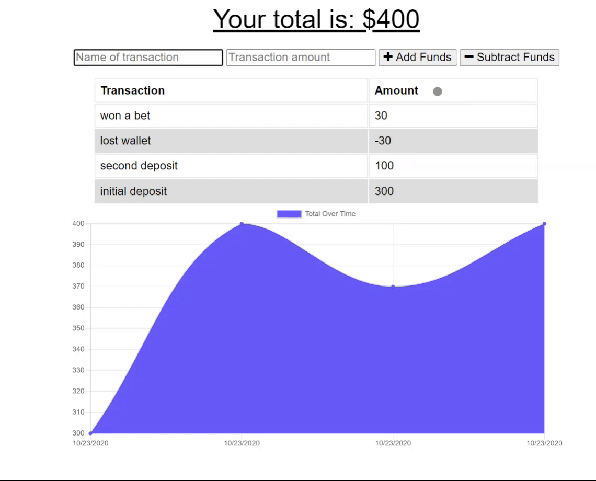

# PWA BudgetTracker

## Description 

A PWA that allows you to enter deposits and withdrawals both offline and on. When the connection to the internet reestablishes it will update the database with all your offline entries. 

## Table of Contents
* [Description](#description)
* [Installation](#installation)
* [Usage](#usage)
* [License](#license)
* [Built With](#built%20with)
* [Questions](#questions)

## Installation
To install this application from git use `npm i`

## Usage
As a responsible individual that watches my finances I want to be able to save my transactions both online and off.

### Deployment
Check out the deployment at [https://offlinebudgettracker1.herokuapp.com/](https://offlinebudgettracker1.herokuapp.com/)

## License
MIT License - A short and simple permissive license with conditions only requiring preservation of copyright and license notices. Licensed works, modifications, and larger works may be distributed under different terms and without source code.

## Built With
This was built using Javascript, Node, and Express. 

## Questions
If there are any questions please reach out to me on my Github [www.github.com/Beki-G](www.github.com/Beki-G) 

